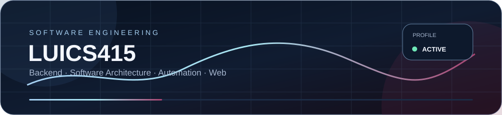
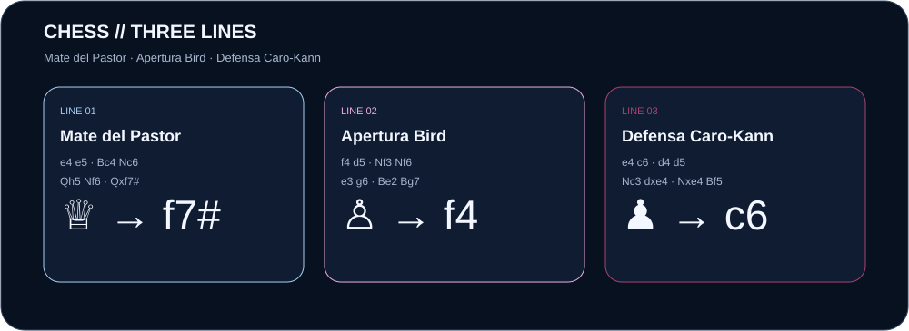
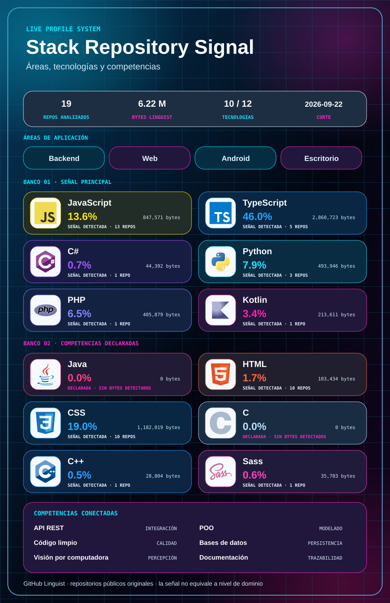
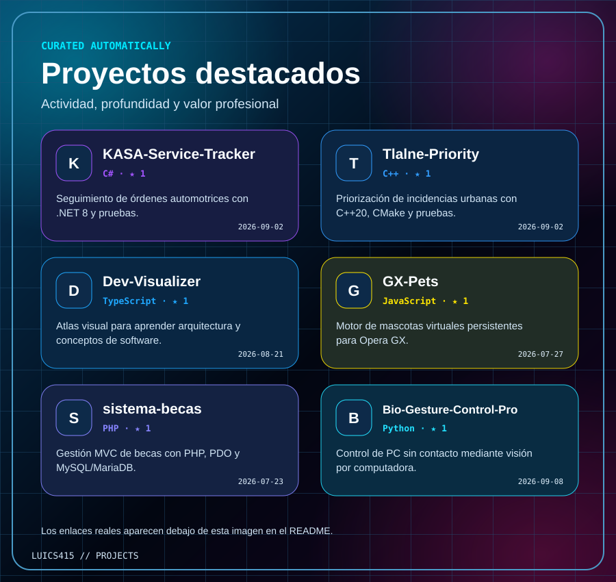
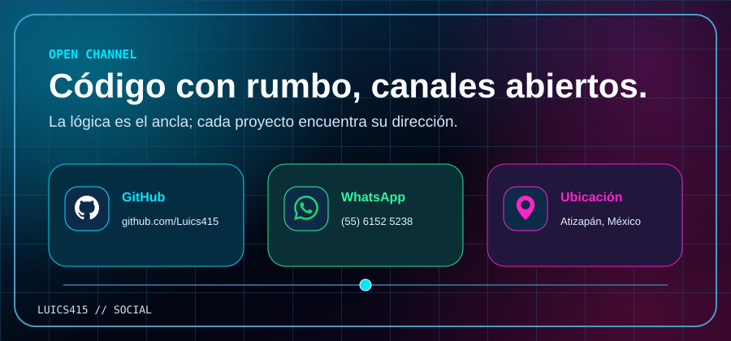

  <picture>
    <source srcset="./assets/hero.gif" type="image/gif" />
    
  </picture>

Construyo soluciones de software orientadas a problemas reales, con énfasis en
arquitectura limpia, calidad de código y aprendizaje continuo.

[Explorar mis repositorios](https://github.com/Luics415?tab=repositories)

  <picture>
    <source srcset="./assets/chess.gif" type="image/gif" />
    
  </picture>

---

## 👨‍💻 Sobre mí

Soy desarrollador de software y estudiante de **Ingeniería en Desarrollo y
Gestión de Software** en la **Universidad Tecnológica Fidel Velázquez**.

Tengo experiencia en la creación y el mantenimiento de aplicaciones web,
incluyendo sistemas para servicios de gobierno digital. Me interesa comprender
cómo funcionan los sistemas, diseñar soluciones escalables y convertir
necesidades reales en software claro, confiable y mantenible.

- 🎓 **Formación:** Ingeniería en Desarrollo y Gestión de Software
- 🏫 **Universidad:** Universidad Tecnológica Fidel Velázquez
- 🎂 **Edad:** 23 años
- 📍 **Ubicación:** Atizapán, México
- 💡 **Intereses:** backend, arquitectura de software y visión por computadora

---

## 🚀 Competencias

  <picture>
    <source srcset="./assets/stack.gif" type="image/gif" />
    
  </picture>

<!-- STACK-DATA:START -->

Datos y metodología de la señal

| Tecnología | Señal de repositorios |
| --- | ---: |
| Java | 0.0% |
| HTML | 2.1% |
| CSS | 18.1% |
| C | 0.0% |
| C++ | 0.6% |
| Sass | 0.7% |
| JavaScript | 16.9% |
| TypeScript | 47.8% |
| C# | 0.9% |
| Python | 0.6% |
| PHP | 8.1% |
| Kotlin | 4.3% |

Calculado con bytes informados por GitHub Linguist sobre repositorios públicos
originales, sin forks ni copias conocidas. **No representa nivel de dominio
personal.** Catálogo: 25 repositorios
públicos encontrados y 18 analizados
para la señal. Corte: 2026-08-31.

<!-- STACK-DATA:END -->

---

## ⭐ Proyectos destacados

  <picture>
    <source srcset="./assets/projects.gif" type="image/gif" />
    
  </picture>

<!-- PROJECT-LINKS:START -->
- [KASA-Service-Tracker](https://github.com/Luics415/KASA-Service-Tracker) — Seguimiento de órdenes automotrices con .NET 8 y pruebas.
- [Tlalne-Priority](https://github.com/Luics415/Tlalne-Priority) — Priorización de incidencias urbanas con C++20, CMake y pruebas.
- [Dev-Visualizer](https://github.com/Luics415/Dev-Visualizer) — Atlas visual para aprender arquitectura y conceptos de software.
- [GX-Pets](https://github.com/Luics415/GX-Pets) — Motor de mascotas virtuales persistentes para Opera GX.
- [sistema-becas](https://github.com/Luics415/sistema-becas) — Gestión MVC de becas con PHP, PDO y MySQL/MariaDB.
- [palabra-y-oracion](https://github.com/Luics415/palabra-y-oracion) — Biblia, Rosario y oraciones con lector de voz accesible.

_La selección visual se regenera con metadatos públicos; los enlaces anteriores permanecen accesibles y clicables._
<!-- PROJECT-LINKS:END -->

<!-- ALL-PROJECTS:START -->

Ver los 19 proyectos públicos elegibles

- [Dev-Visualizer](https://github.com/Luics415/Dev-Visualizer) — Atlas visual para aprender arquitectura y conceptos de software.
- [GX-Pets](https://github.com/Luics415/GX-Pets) — Motor de mascotas virtuales persistentes para Opera GX.
- [KASA-Service-Tracker](https://github.com/Luics415/KASA-Service-Tracker) — Seguimiento de órdenes automotrices con .NET 8 y pruebas.
- [sistema-becas](https://github.com/Luics415/sistema-becas) — Gestión MVC de becas con PHP, PDO y MySQL/MariaDB.
- [palabra-y-oracion](https://github.com/Luics415/palabra-y-oracion) — Biblia, Rosario y oraciones con lector de voz accesible.
- [Bio-Gesture-Control-Android](https://github.com/Luics415/Bio-Gesture-Control-Android) — Control gestual experimental para Android con MediaPipe.
- [Bio-Gesture-Control-Pro](https://github.com/Luics415/Bio-Gesture-Control-Pro) — Control de PC sin contacto mediante visión por computadora.
- [AussieCare](https://github.com/Luics415/AussieCare) — PWA cinematográfica, mobile-first y offline para aprender cuidados responsables del periquito australiano.
- [Tlalne-Priority](https://github.com/Luics415/Tlalne-Priority) — Priorización de incidencias urbanas con C++20, CMake y pruebas.
- [stone-paper-and-scissors](https://github.com/Luics415/stone-paper-and-scissors) — Juego de Piedra Papel o Tijeras, pero mas emocionante
- [caso-final-estudio](https://github.com/Luics415/caso-final-estudio) — Pipeline de Liberación y Despliegue Continuo
- [multipleWindow3dScene](https://github.com/Luics415/multipleWindow3dScene) — Aplicación crea una escena 3D con partículas animadas, controles de cámara orbital y un efecto visual que cambia según el nivel de audio capturado por el navegador.
- [Credit-Card](https://github.com/Luics415/Credit-Card) — Un estilo para ocasiones que se requieren pagos web
- [MenuGiratorio](https://github.com/Luics415/MenuGiratorio) — Menú giratorio con iconos, donde al presionar el botón central se despliegan las opciones alrededor del círculo y se resalta la opción seleccionada.
- [Cubo-Rubik](https://github.com/Luics415/Cubo-Rubik) — Proyecto de software documentado en GitHub.
- [break_the_glass](https://github.com/Luics415/break_the_glass) — Proyecto de software documentado en GitHub.
- [gatitos-app](https://github.com/Luics415/gatitos-app) — Proyecto de software documentado en GitHub.
- [GX-Pets-Azlynn-Edition](https://github.com/Luics415/GX-Pets-Azlynn-Edition) — Proyecto de software documentado en GitHub.
- [curriculum](https://github.com/Luics415/curriculum) — Actividad 13

_Esta lista se regenera automáticamente; excluye el repositorio del perfil, forks, repositorios archivados y copias configuradas._

<!-- ALL-PROJECTS:END -->

---

## 📈 Enfoque actual

Actualmente continúo fortaleciendo mis conocimientos en:

- Desarrollo backend y ecosistema Java.
- Arquitectura de software y API REST.
- Patrones de diseño, pruebas y código limpio.
- Documentación técnica.
- Visión por computadora con Python.

---

## 🎯 Objetivo profesional

Busco oportunidades para contribuir como desarrollador de software y continuar
creciendo en desarrollo backend e ingeniería de software. Me motivan los
proyectos que exigen resolver problemas complejos, aprender nuevas tecnologías
y crear productos con impacto real.

---

## 📫 Contacto

  <picture>
    <source srcset="./assets/social.gif" type="image/gif" />
    
  </picture>

### Luis Enrique Rivera Delgado

**Desarrollador de Software · Backend**

[GitHub](https://github.com/Luics415) ·
[WhatsApp: (55) 6152 5238](https://wa.me/525561525238) ·
**Atizapán, México**

Disponible para colaborar en proyectos de desarrollo de software y nuevas
oportunidades profesionales.

---

*“El software va más allá de escribir código: consiste en comprender problemas
y construir soluciones confiables.”*

